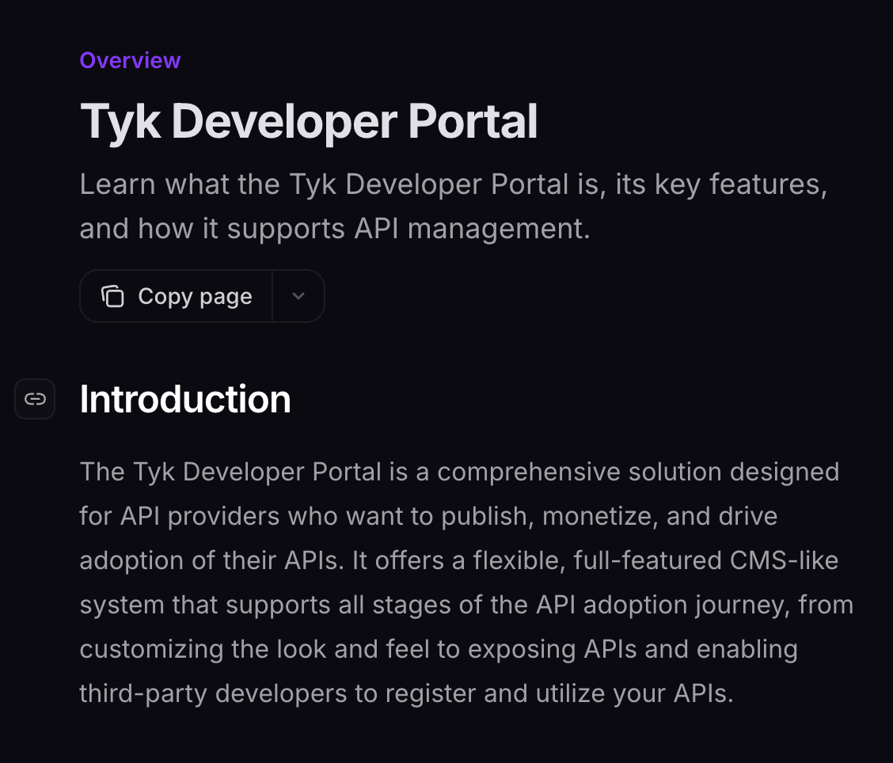
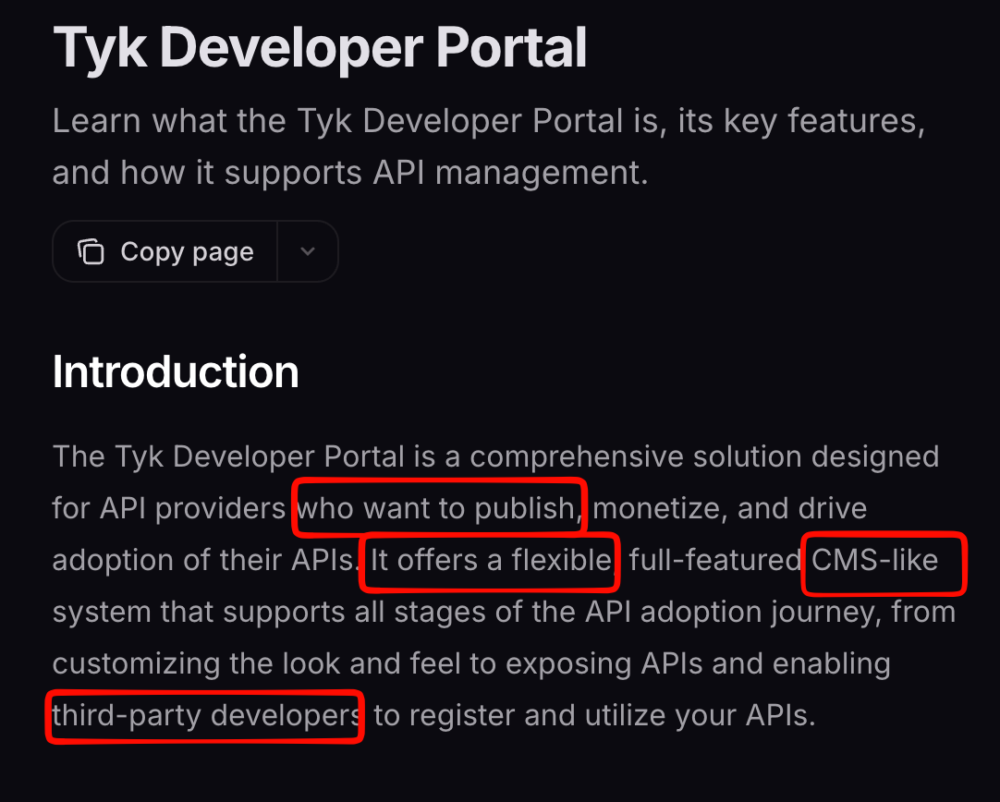

## ¿Que carajo con esto?

La mejor fucking manera de sacar AV (Attack Vectors), leyendo el jodido manual (documentación) y entendiendo la aplicación / sistema, etc...

Con esto puedes ir sacando tus AV y sus AVV (Attack Vector Value), esto nos ayudará a sacar un bonche de vias de ataque y esas se pueden convertir en:

- Vulnerabilidades
- Gadgets
- Etc

> Tú eres el encargadx de sacar las locas o reportar medias...

## RTMF (READ THE FUCKING MANUAL)

Ya lo he dicho antes lee el jodido manual, la documentación es muy poderosa, te perimte a ti sacar hipotesis y hacer la actividad más infravalorada de todo hacker que es el 🥁🥁🥁 **Threat Model**. Así es mi querido rojito, "eso nunca se ve", "eso cuando", bla bla bla... Precisamente por eso cuesta mucho trabajo el idear vectores de ataque chulos, si bien se aprenden con el tiempo y con el colmillo aquí es para hacerlos más dirigidos y con más punch. 

Pero 10, puta hueva ¿Te refieres a un modelo STRIDE o cómo? pues yo lo implemento y además lo hago cómo hacker.

## Threat Model

### ¿Qué es?

Un threat model (modelo de amenazas) es un proceso estructurado para **identificar, analizar y mitigar posibles vulnerabilidades y riesgos de seguridad** en sistemas, aplicaciones o redes antes de que sean atacados, pensando como un atacante para diseñar defensas.

Pero en nuestro caso nos sirve pare diseñar vectores de ataque y posibles bypasses ante posibles protecciones diseñadas por el cliente.

### ¿Por qué es importante?

Bien, necesitamos entender a fondo y conscientemente el objetivo que estamos atacando y ¿por qué? bueno eso nos va a permitir generar vectores de ataque especificos en este.

Y la forma en como vamos a hacer eso es generando y entendiendo el threat model de la aplicación (modelo de amenazas, donde le vamos a colar el gol).

>**Nota:** Recuerda que los devs ven todo de una forma general :)

### ¿Esto como se ve o como se hace?

Necesitamos leer la documentación, entender cómo chingados el producto que estamos hackeando funciona y saber que cosas si son una vulnerabilidad y que cosas no son una vulnerabilidad.

Ejemplo: si tienes un perfil público y puedes hacer un leak de información de cada perfil publico, eso pues... no es una vulnerabilidad, pero si puedes leeakear info de uno privado pues eso si sea una vulnerabilidad.

### Debes pensar

- ¿Qué partes de la app tiene data sensible?
- ¿Qué partes de la app deberían tener control de acceso?
- Donde estos limites de acceso están marcados.
- ¿Qué llaves de restricción hay en este lugar que se deberían bypassear?

### La meta que debemos tener cuando trabajamos sobre una app

**CONVIERTETE EN EL EXPERTO DEL MUNDO DE ESA APLICACIÓN**. **Nadie debe saber mejor que tú esa aplicación mejor que tú.**

### ¿Cómo?

**Read The Fucking Manual**

Lee la jodida documentación, ve post con respecto a esta, ve a youtube, ve videos de desarrollador y cómo usar lo que esta app.

Toma de ejemplo cualquier aplicación con documentación.

[Mira la primera que encontré en google](https://tyk.io/docs/portal/overview/intro)

#### ¿Qué puedes ver ahí?

Te digo que veo yo:

Es muy por encima pero para que te des una idea:

- who wants to publish - ¿A quién? ¿Por donde? ¿Es público o privado?
- It offers a flexible - ¿Qué tan flexible es? ¿Hay control de acceso?
- CMS-like - ¿Comparten dependencias de otros CMS?¿Es propio?¿Maltego, Joomla Wordpress?¿Si es una versión conocida y vulnerable, habrá exploits?
- Third party developers - ¿Integraciones de terceros? ¿Webhooks? ¿SSRF? ¿Github?

> Esto a mi me induce a mi como hacker en pensar en cosas como: ¿Hay IDORS? ¿Hay Broken Access Control? ¿Hay Roles que pueda tomar? ¿Hay cosas de segundo orden (que esten ligadas a APIs)?

Todo eso por leer y analizar la introducción de esta aplicación.

Podría hacer el analisís completo de toda la documentación que tienes acá, pero me llevaría una eternidad publicarlo acá, si es que alguien está leyendo esto pues llevatelo de tarea, por lo mientras sigo con los pro tips, pero es un ejemplo para que veas por donde va este show.

> SUPER PRO TIP: SI VES PALABRAS COMO **MUST** OR **CANNOT** INTENTALO
