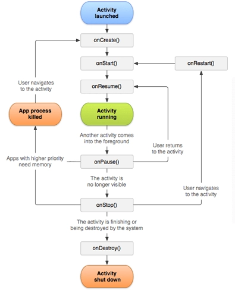

## ¿Qué es?
Una activity es una acción concreta y específica que puede realizar el usuario.

Casi todas las activities interactúan con el usuario, por lo que la clase Activity se encarga de crear una ventana en la que se puede colocar la interfaz de usuario

Las activities se encuentran dentro del AndroidManifest y debemos de entender que estas son el punto de entrada a cualquier pantalla de la app.

Cuando iniciamos un aplicativo android, este iniciara un activity, el cual es el MainActivity y podemos buscarlo en el AndroidManifest con el action MAIN y el category LAUNCHER.

Ejemplo:

```markdown
<activity android:name="io.cabr4.reversingexample.MainActivity" android:exported="true">
            <intent-filter>
                <action android:name="android.intent.action.MAIN"/>
                <category android:name="android.intent.category.LAUNCHER"/>
            </intent-filter>
        </activity>
```

## Exported Activities

Estas pueden ser iniciadas por otras apps o via adb y tienen la flag exported:true

```markdown
 <activity android:name="io.cabr4.reversingexample.SecretActivity" android:exported="true"/>
```

Para iniciar una actividad exportada de la aplicación

```
adb shell am start <package_name>/<activity_name>
```

Ciclo de vida de una activity



