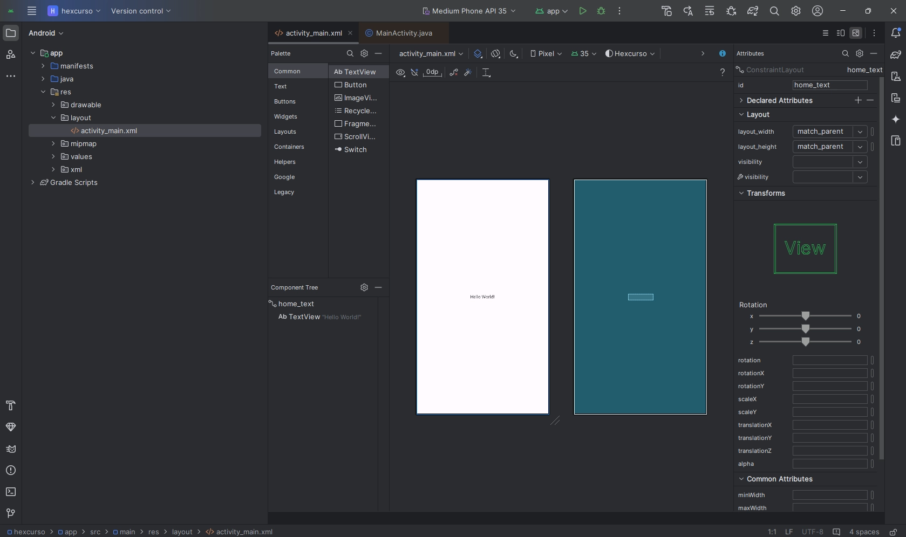
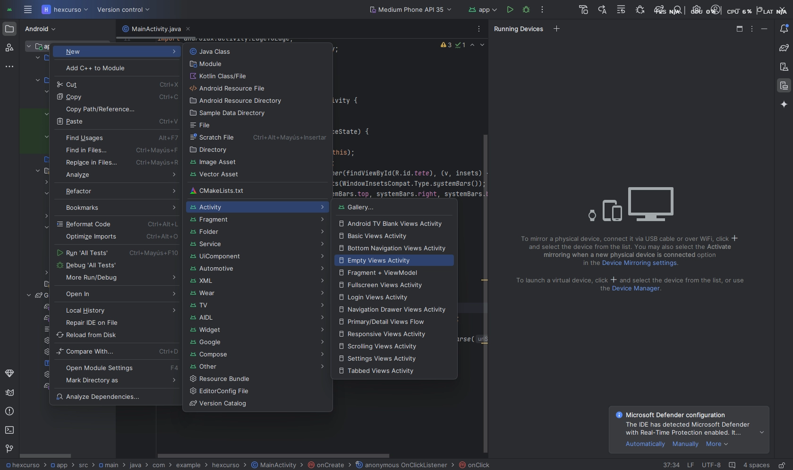

## ¿Qué es?

Algunas veces, para explotar alguna vulnerabilidad, es necesario llevar a cabo el desarrollo de alguna aplicación

Para desarrollar una app, es obviamente necesario instalar Android Studio.

Posterior a la instalación, la forma mas sencilla de crearlo es seleccionando **Empty** **Views** **Activity** y seleccionar JAVA como lenguaje.

En android la UI se representa mediante Layouts (los cuales son ficheros xml). Sin embargo Android Studio cuenta con un editor grafico. (app/res/layout/)



Para aplicaciones PoC no es necesario que se tenga una UI linda, basta con tener conocimientos basicos. Lo mas importante es saber como se le puede dar un ID a el elemento(esquina superior derecha), para posteriormente referenciarlo en el codigo JAVA:

```java
// update the text from code
TextView homeText = findViewById(R.id.home_text);
homeText.setText("Hello!");
```

La R es porque es un Recurso. y el id es “home_text”

De igual forma, es necesario manejar cuando se da click a un boton para poder triggerear los ataques:

```java
Button homeButton = findViewById(R.id.home_button);
homeButton.setOnClickListener(new View.OnClickListener() {
    @Override
    public void onClick(View v) {
        Log.v("Cabr4", "Button has been clicked!");
    }
});
```

Para crear un intent, se puede realizar con el siguiente codigo. El cual genera un intent con ACTION_VIEW y la url k3vzz.com. Lo que hara android es verificar que app puede manejar esto (navegador que en su AndroidManifest.xml cuente con un intent-filter que indique que puede manejar ACTION_VIEW con el protocolo https (chrome/android/java/AndroidManifest.xml - chromium/src - Git at Google))

```java
Intent browserIntent = new Intent(Intent.ACTION_VIEW, Uri.parse("https://k3vzz.com/"));
startActivity(browserIntent);
```

En el caso de querer recibir un intent, tambien es posible, solo tenemos que hacer nuestra app disponible para las demas apps exportando una actividad que pueda ser iniciada por otras apps, añadiendo un intent-filter en el Android Manifest:

```java
// AndroidManifest.xml
<intent-filter>
    <action android:name="android.intent.action.SEND" />
    <data android:mimeType="text/plain" />
    <category android:name="android.intent.category.DEFAULT" />
</intent-filter>
```

Para crear una nueva activity:


Para manejar lo que se reciba, bastaria con colcar getIntent() dentro del codigo Java de la app.

```java
        Intent receivedIntent = getIntent();
        String sharedText = receivedIntent.getStringExtra(Intent.EXTRA_TEXT);
        if (sharedText != null) {
            TextView debugText = findViewById(R.id.debug_text);
            debugText.setText("Shared: " + sharedText);
        }
```

Para compilar basta con ir a la hamburguesa > build > build bundles(apk)

Siempre se puede consultar la documentación oficial de android para aprender sobre los recursos:

- https://developer.android.com/?hl=es-419