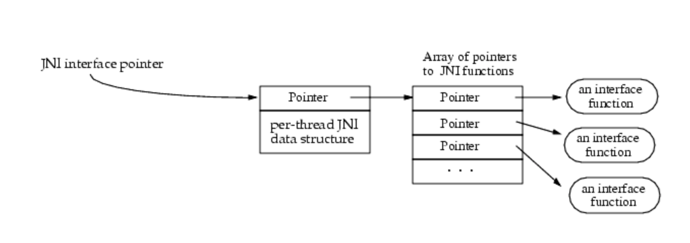

## ¿Qué es?
Si deseamos conocer como funciona el aplicativo, y darnos un indicio de su codigo interno, asi como entender que esta haciendo realmente podemos llevar a cabo ingenieria inversa dentro del apk

Puntos importantes al hacer reversing:

- Objetivo: CUANDO HAGAS REVERSING, SIEMPRE TEN UN OBJETIVO.
P.EJ. A que url se conecta?, como hace esta validacion?, etc…
- API CALLS: Si buscas por ejemplo una funcionalidad de envio de SMSs, es posible buscar las APIs de envio, y filtrar unicamente por eso para encontrar rapidamente el flujo, por ejemplo: `sendTextMessage`, `sendMultipartMessage`,`smsto`
- App Entry Poins: Si no se sabe donde iniciar, el entry point de la app siempre es la mejor idea.
- Decryption Methods: Si se pasan muchas strings raras siempre hacia los mismos metodos, lo mas probable es que sean metodos de cifrado/descifrado.

Gracias a caracteristicas del lenguaje JAVA, como la reflexion, las apps suelen conservar todos sus simbolos (A menos que se ofusquen).

De igual forma el bytecode de Dalvik es de relativamente alto nivel, por lo cual contiene mucha información sobre la estructura y el flujo de la app, haciendo que se obtengan resultados muy cercanos a la app original cuando se lleva a cabo la decompilación.

Por lo cual, debido a esto, es bastante probable que la app este ofuscada.

Para llevar a cabo el proceso de reversing, la herramienta mas comun es jadx-gui, la cual permite importar directamente el apk y decompila a JAVA, haciendo que se pueda observar el codigo generado y permite una navegación super sencilla.

## JADX

Dentro de JADX-GUI es posible poner comentarios con click derecho → poner comentario.

Con ctrl+click sobre una función podemos entrar a el código donde se encuentra.

Las strings en las apps de Android no suelen estar hardcodeadas, sino que se incluyen en los recursos. Si en la app que se esta analizando hay algo tipo R.id o R.string, significa que se ha cargado un recurso desde el directorio de recursos o el archivo resources.asrc.

La mejor forma de encontrar el recurso es utilizando la búsqueda global de jadx.

Cuando extraemos/desensamblamos los datos de una apk nos encontraremos con ficheros smali/baksmali (ensamblador/desensamblador). Estos ficheros son la decompilación de los ficheros .dex, representados en un lenguaje de bajo nivel. Y nos ayudan a tener mejor legibilidad del codigo. A este proceso se le llama reversing

Dentro de JADX, es posible ver el smali, dando clic en la parte inferior en el boton de smali, y de igual forma es posible tener el codigo y el smali en pantalla dividida para poder trabajar mejor.

Para guardar en jadx basta con ir a file y save project, se guardara un fichero .jadx que contendra toda la decompilacion en un solo fichero.

De igual forma es posible utilizar jadx solo para la decompilacion a JAVA y utilizar un IDE distinto.

---------


Al llevar a cabo el analisis de una aplicacion, puede que nos encontremos con funciones nativas o JNI(Java Native Interface), este es codigo nativo, comunmente en C o C++, se pueden identificar por la palabra native (y tambien por System.loadLibrary("nativelib")o System.load("full/path/to/lib.so")). Estas tienen muchas ventajas en performance y nos ayudan a generar librerias.

## Nativo

Si queremos llevar a cabo el analisis de funciones implementadas de forma nativa, es necesario abrir el fichero .so (Este se encuentra en la carpeta /lib/arquitecturaelegida) en una herramienta de reversing como ghidra o ida.

Al encontrar la función seguramente nos encontraremos algo del tipo:

```c
void Java_app_Class_getKey(_JNIEnv *param1, undefined4 param_2, _jstring *param3) {
	xorDecrypt(param1,param3);
	return;
}
```

Expliquemos los parametros:

- `JNIEnv *JNI`: puntero a la tabla de funciones JNI. Siempre es el primer argumento en nativos JNI.
- `undefined4 param_2`: En JNI este **segundo** parámetro es:
    - `jobject thiz` si el método es **no estático**, o
    - `jclass clazz` si el método es **estático**.
- `_jstring *cadena`: eso es un `jstring` (el alias interno es `_jstring`). Es la cadena Java que llega al nativo. (Aqui ya estarian las variables que recibe cada uno de las funciones)

Corregir la firma se veria asi:

```c
void getKey(JNIEnv *env, jobject thiz, jstring cadena); //No estatico

void getKey(JNIEnv *env, jclass clazz, jstring cadena); //estatico
```

Como se puede observar, hay algo llamado JNIEnv, esto es super relevante, ya que nos dará muchas funciones que se utilizan en el binario

## JNINativeInterface

`JNIEnv*` es un puntero a una tabla de punteros a funciones (`JNINativeInterface *`).



Cuando se tiene algo del tipo `(**(code **)(*(int *)JNI + 0x2a4))` en ghidra. Lo que realmente sucede es que se tiene el puntero de JNI y se le estan sumando 0x2a4 bytes. Posterior a llevar a cabo dicha suma, se llama a la función que este en esa dirección.

Para saber que función es, se divide 0x2a4 por el tamaño del puntero (4 en 32-bit y 8 en 64-bit), lo cual dara el indice dentro de JNINativeInterface.

Posteriormente bastaria con mirar el jni.h o la definición de JNINativeInnterface y buscar la función con ese indice.

Ejemplo (32 bit):

`(**(code **)(*(int *)JNI + 0x2a4))`

`0x2A4 = 676`

`676 / 4 = 169`

Al buscar en jni.h veremos que es `GetStringUTFChars`

Otra estrategia que se puede usar es crear una app, importar la libreria y llamarla con los mismos parametros de entrada para ver la salida.

-------

Cuando analizamos actualizaciones de aplicaciones la forma mas eficiente de hacerlo es mediante la diferencia de los ficheros esto se puede hacer mediante diff o la extensión Compare Folders(moshfeu) de VSCODE


Instrucciones de SMALI: 

- https://source.android.com/docs/core/runtime/dalvik-bytecode?hl=es-419#instructions